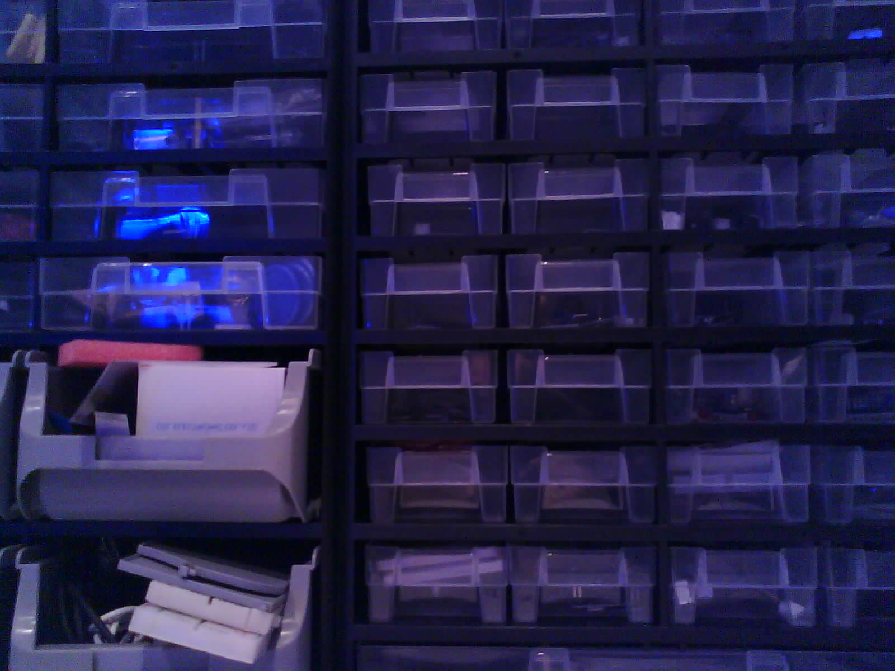

# ESP32-Cam MQTT-Publisher (Micropython)

A simple example how to send continously a captured image from the Camera to a MQTT Broker and receive them from a webpage. The publisher of the ESP32 is written in Micropython.

*You need a running MQTT Broker like Eclipse Mosquitto or HiveMQ*

## How it works
The ESP32 will automatically connect to your WLAN, install necessary packages and send continously the captured image to a MQTT Broker. There are two files to set up the program. In the ```config.py``` you set the WLAN and MQTT information. In the ```boot.py``` you can change the camera settings.\
With the example clients you can test that everything works and build your own use cases. An example image you can find in the [Example Image](#example-image) section.

## Resources

* [ESP32-Cam module](https://www.az-delivery.de/products/esp32-cam-modul-esp32-wifi-bluetooth-modul-inklusive-kamera)
* [FT232rl with 5V support](https://www.az-delivery.de/products/ftdi-adapter-ft232rl)
* [Mini-USB-B-Kabel](https://www.reichelt.de/de/de/usb-2-0-kabel-a-stecker-auf-mini-b-stecker-1-5-m-ak-673-a-p45361.html?r=1)   
* [Jumper Cable Female-Female](https://www.az-delivery.de/products/40-stk-jumper-wire)

## Installation
>Disclaimer: CMD == Command Line == Powershell

### Connect ESP32 with FT2324rl
1) Set the voltage support of the FT232rl to 5V
2) Connect FT232rl and ESP32-Cam with jumper cables according this table\
    | Pin FT232rl | Pin ESP32-Cam |
    | --- | --- |
    | RX | U0T |
    | TX | U0R |
    | VCC | 5V |
    | GND | GND (under U0T) |
3) Use another jumper cable to connect IO0 and GND (both on ESP32) to reach the bootloader/flash mode

### Install Python, esptools and ampy
*Notes for Windows: In this chapter you need to do changes on your System Environment Variables and install packages with PIP. If you change the variables you need to close the cmd to apply the changes. Sometimes when you install packages with pip then it fails. Then you need to open a cmd in administration mode.*

1) Install Python (3.x) with pip your system.
2) (Windows) Add the folder ```PYTHON_HOME/lib/site-packages``` (PYTHON_HOME: Installation directory of Python) to the ```PATH``` variable in the system environment variables
3) Install the package esptool (Flash tool)\
    ```pip install esptool```
4) (Windows) Install the package ampy (Serial Communitcation tool)\
    ```pip install adafruit-ampy```

### Flash Micropython
In order to access the camera we need a customized image of micropython with camera support. In the folder ```firmware``` you can find an image from 2022-01-28 with ```micropython 1.17```. In this [repository](https://github.com/lemariva/micropython-camera-driver) maybe you can find a newer version and a tutorial how to build and compile your own micropython with native camera support.

1) Connect your computer with the FT232. (Maybe you need to download the [FTDI Drivers](https://ftdichip.com/drivers/vcp-drivers/) for windows)
2) Check with `mode` (Windows) or `ls /dev/ttyUSB*` (Linux) if the ESP32 is connected
3) Erase the flash memory of the ESP32 (replace <YOUR_PORT> with COM (Windows) or /dev/ttyUSB (Linux) and the according port number)\
    ```esptool.py --chip esp32 --port <YOUR_PORT> erase_flash```
4) Flash the customized micropython firmware to the ESP32\
    ```esptool.py --chip esp32 --port <YOUR_PORT> --baud 460800 write_flash -z 0x1000 ./firmware/micropython_3a9d948_esp32_idf4.x_ble_camera.bin```
5) **Remove the jumper cable between GND and IO0 and reboot the ESP32**

### Copy files
>Micropython will automatically run at startup the ```boot.py``` script and immediately afterwards the ```main.py``` script.

1) Update the ```config.py``` and ```main.py``` (camera settings) file to meet your requirements
2) Copy the files (boot.py, main.py, config.py) from the root directory (no subfolders) to the ESP32 (order is not relevant)\
    ```ampy -p <YOUR_PORT> put <FILE>```
3) Restart the ESP32 (reconnect to Computer or use this command). If everything has been set correctly, the ESP32 should now send images to the MQTT broker at the set interval.\
    ```ampy -p <YOUR_PORT> reset```

*With ampy it is also possible to run the code from the command line or bash. Just copy the file to the ESP32 and then use ```ampy -p <YOUR_PORT> run <FILE>```. This is very useful for debugging purposes.*

### Le End
If the ESP32 successfully sends the image to the MQTT Broker you can receive it with any MQTT client, like Eclipse Paho. In the folder ```clients``` you can find 2 examples for that. The HTML client won't need any webserver. You can open it in your browser directly.

# Sources
* [LeMaRiva|tech Blog](https://lemariva.com/blog/2020/08/micropython-ov2640-camera-module-extended)
* [uPyCam Repository - Timelaps branch](https://github.com/lemariva/uPyCam/tree/timelapse-camera)

# Example image
